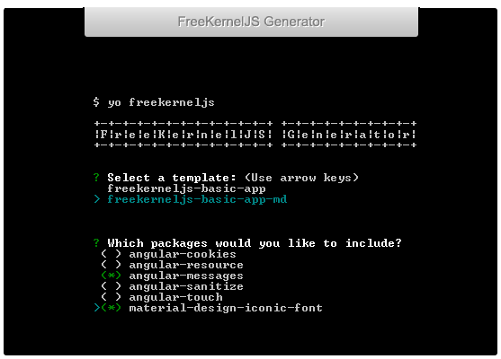
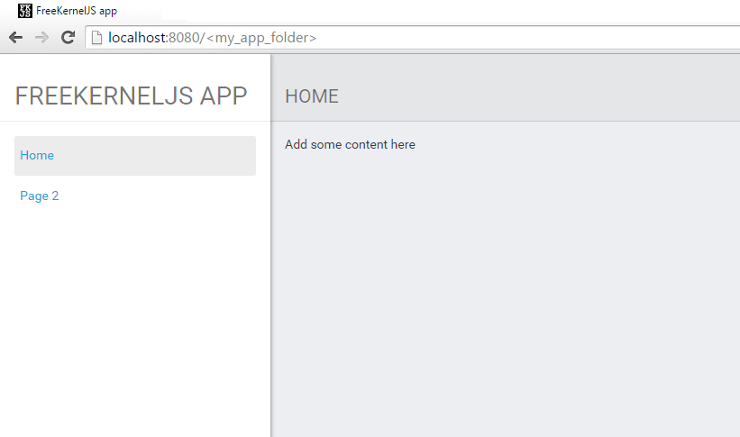

# generator-freekerneljs

[](http://yeoman.io/)
[](http://gruntjs.com/)

Generates a web app structured from a template.
This app can then be used to start and develop your own application.

Table of Contents:
-  [Templates](#templates)
-  [Installation](#installation)
-  [Create a New App](#generating)
-  [Tools](#tools)
-  [Release History](#history)


### <a name="templates"></a> Templates
------------
Templates available for producing applications:
- [freekerneljs-basic-app](app/templates/freekerneljs-basic-app): a basic application which uses AngularJS with Bootstrap
- [freekerneljs-basic-app-md](app/templates/freekerneljs-basic-app-md): a basic application which uses AngularJS with Angular Material


### <a name="installation"></a> Installation
------------

###### Step 1: Setup your environment if you have not done so yet.
- Install [Node.js](https://nodejs.org) (including npm)
- Then Install <a href="http://bower.io/">Bower</a> and <a href="http://yeoman.io/">Yeoman</a> globally:
``` 
    $ npm install -g bower
    $ npm install -g yo
```


###### Step 2: Install FreeKernelJS Generator globally: 
``` 
    $ npm install -g generator-freekerneljs 
```


### <a name="generating"></a> Create a New App
------------

###### Step 1: Create a new folder where you would like for your app files to be output by the generator, and switch to it:
```
    $ mkdir <project_folder>
    $ cd <project_folder>
```


###### Step 2: Run the generator:
``` 
    $ yo freekerneljs 
```
If the generator is already installed and a newer version is available it will notify you of this. Alternatively you can use this command to upgrade:
``` 
    $ npm update -g generator-freekerneljs 
```
During installation, various configuration values can be set for your application. 
The generator wizard will prompt you for values, or you can leave all as default by pressing enter. 
After the installation is complete you can still set these values manually.



- **Select a template**. Select which template you would like to use. For more details see [Templates](#templates) section above.
- **Packages to be included**. Use arrows and spacebar to select which packages to inclued in your application. This can be managed later from bower.json file.
- **Application name**. The name of the folder which contains the application, it will also be used as the name of the main module of the application in the JavaScript files.
- **Title of the application**. The window title in browser, and the name of the application as displayed above the navigation bar. This can be managed later in code (see index.html, widgets/navbar/template.html)
- **Description**. The description of this application, can be managed in package.json
- **Version**. The <a href="http://semver.org/">version</a> of this application, can be managed in package.json (default to 1.0.0).
- **License**. The license of this application, can be managed in package.json (default to MIT).
- **GitHub repository**. Can be managed in package.json
- **GitHub username**. Can be managed in package.json
- **Author name**. Can be managed in package.json
- **Author email**. Can be managed in package.json
- **Author url**. Can be managed in package.json
- **Home page**. Can be managed in package.json


###### Step 3: After installation is successful you can find all the output files at this path:
``` 
    $ cd <project_folder>/dist/debug
```
You can copy them to your server root and run the application in browser.

This should be the result:




Here is an example to an application that has been developed using FreeKernelJS Generator, and is based on [freekerneljs-basic-app-md](app/templates/freekerneljs-basic-app-md):

<a href="https://github.com/FreeKernelJS/demos/tree/master/freekerneljs-demo-app">Demo App</a>


> For general questions and discussions, use the
  [FreeKernelJS Forum](http://www.forum.freekerneljs.org/).


### <a name="tools"></a> Development Tools
-----------------
You might want to consider using these tools to continue and develop the application:
- Install <a href="http://gruntjs.com/">Grunt</a> and use it to run tasks such as - debug, dist and watch.
``` 
    $ npm install -g grunt-cli
```
- Install <a href="https://www.ruby-lang.org/en/">Ruby</a> to compile the scss files (manually or through Grunt). 
``` 
    $ gem install sass
    $ npm install grunt-contrib-sass --save-dev
```


### <a name="history"></a> Release History
----------------
See the [CHANGELOG](CHANGELOG.md).
